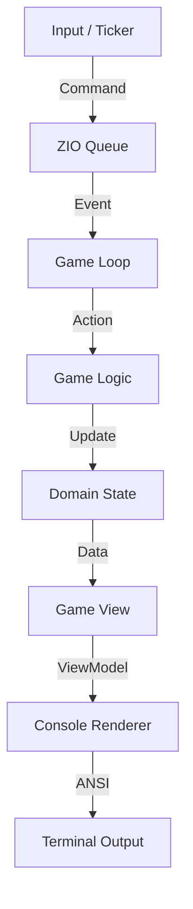

# Monadris


[](https://codecov.io/gh/fffclaypool/monadris)


A functional Tetris implementation in Scala 3 + ZIO.

## Features

- **Immutability**: All data structures are immutable (`case class` / `enum`).
- **Pure Functions**: Core logic follows `(State, Input) => State` signature.
- **3-Layer Architecture**: Strict separation between Domain/Logic, View, and Infrastructure.
- **Event-Driven**: Game loop utilizes `ZIO Queue` for thread-safe, non-blocking event handling.
- **Effect Separation**: Rendering, input, and time are wrapped in ZIO, completely isolated from core logic.
- **Configurable**: Game settings are loaded from HOCON configuration files.

## Architecture

The application follows a strict unidirectional data flow:



### Layers

1. **Domain & Logic (Pure)**: Defines the game rules and state transitions. No side effects.
2. **View (Pure)**: Transforms `GameState` into `ScreenBuffer` (ViewModel). No ANSI codes, just abstract colors and chars.
3. **Infrastructure (Impure)**: Handles ZIO effects, Console I/O, Queues, and the main loop.

## Requirements

- Java 21+
- sbt 1.9+
- Bash (for execution script)

## Build & Run

**Note:** Please use the provided shell script to run the game. Running directly with `sbt run` may cause display glitches due to terminal mode handling.

```bash
# Compile
sbt compile

# Run tests
sbt test

# Run game
sh run.sh
```

## Controls

| Key | Action |
|-----|--------|
| `←` `→` / `H` `L` | Move left/right |
| `↓` / `J` | Soft drop |
| `↑` / `K` | Rotate clockwise |
| `Z` | Rotate counter-clockwise |
| `Space` | Hard drop |
| `P` | Pause |
| `Q` | Quit |

## Project Structure

```text
src/main/scala/monadris/
├── config/           # Application configuration
│   └── AppConfig.scala
├── domain/           # Immutable data models
│   ├── GameState.scala
│   ├── Grid.scala
│   ├── Tetromino.scala
│   └── Input.scala
├── logic/            # Pure game rules
│   ├── GameLogic.scala
│   ├── Collision.scala
│   └── LineClearing.scala
├── view/             # Presentation logic
│   ├── GameView.scala
│   └── ViewModel.scala
├── infrastructure/   # ZIO effect layer (I/O, Loop)
│   ├── GameRunner.scala
│   ├── ConsoleRenderer.scala
│   ├── TerminalInput.scala
│   └── SystemInterface.scala
└── Main.scala
```

## Testing

```bash
sbt test
```

Comprehensive tests covering:
- **Domain**: Invariants of Grid and Tetrominoes.
- **Logic**: State transitions, collision detection, and line clearing.
- **View**: Layout generation and ViewModel construction.
- **Infrastructure**: Input parsing and loop integration (using ZIO Test environment).

## License

MIT
