# Monadris

[](https://github.com/fffclaypool/monadris/actions/workflows/ci.yml)
[](https://codecov.io/gh/fffclaypool/monadris)


[](.scalafmt.conf)
[](.scalafix.conf)
[](build.sbt)

A strictly functional Tetris implementation in Scala 3 + ZIO.
**Zero variables (`var`), zero exceptions, and zero side effects in the core domain.**

## Demo

https://github.com/user-attachments/assets/4d8b7920-68e7-45d8-9a86-fbe476922b3c

## Features

- **Zero Mutation**: `var`, `null`, `throw`, and `return` are forbidden at compile time via **WartRemover** (in `core`).
- **Physical Separation**: Multi-project architecture strictly isolates pure `core` logic from impure `app` infrastructure.
- **Functional DDD**: Rich domain models with Event Sourcing style: `handle(cmd: GameCommand): (TetrisGame, List[DomainEvent])`.
- **Event-Driven**: Utilizing **ZIO Queue** for non-blocking, thread-safe event handling.
- **Effect Isolation**: Rendering, input, and time are wrapped in ZIO effects.
- **Configurable**: Game settings are loaded from HOCON configuration files.

## Architecture

### 1. Data Flow
The internal state management follows a Functional DDD pattern with Event Sourcing style.

```mermaid
graph LR
    %% Styles
    classDef infra fill:#e3f2fd,stroke:#1e88e5,stroke-width:2px,color:#0d47a1,rx:5,ry:5;
    classDef core fill:#e8f5e9,stroke:#43a047,stroke-width:2px,color:#1b5e20,rx:5,ry:5;
    classDef view fill:#fff3e0,stroke:#fb8c00,stroke-width:2px,color:#e65100,rx:5,ry:5;
    classDef terminal fill:#263238,stroke:#000000,stroke-width:2px,color:#ffffff,rx:10,ry:10;

    InputLoop["InputLoop<br/>(Input → GameCommand)"]:::infra
    Ticker["GameTicker"]:::infra
    Queue["ZIO Queue"]:::infra
    Engine["GameEngine"]:::infra
    Renderer["ConsoleRenderer"]:::infra

    Game["TetrisGame.handle()"]:::core
    Events["DomainEvents"]:::core

    View["GameView"]:::view

    Terminal(("Terminal Output")):::terminal

    InputLoop -->|GameCommand| Queue
    Ticker -->|Tick| Queue
    Queue -->|Command| Engine
    Engine -->|Command| Game
    Game -->|"(State, Events)"| Engine
    Engine -->|Events| Events
    Game -->|State| View
    View -->|ScreenBuffer| Renderer
    Renderer -->|ANSI| Terminal
```



### 2. Module Separation (DDD Layers)
The project is physically split into two SBT modules to prevent architectural erosion, following Domain-Driven Design principles.


| Layer | Project | ZIO Dependency | Description |
|-------|---------|----------------|-------------|
| **Domain Model** | `core` | **No** | Aggregates (`TetrisGame`, `Board`, `ActivePiece`), Value Objects (`ScoreState`) |
| **Domain Service** | `core` | **No** | Domain services (`PieceQueue` - 7-bag algorithm) |
| **View** | `core` | **No** | Pure transformation (`TetrisGame => ScreenBuffer`) |
| **Application** | `app` | **Yes** | Use case orchestration (`GameEngine`) |
| **Infrastructure** | `app` | **Yes** | ZIO effects, Console I/O (`Terminal`, `ConsoleRenderer`, `InputLoop`, `GameTicker`) |

### 3. Runtime Event Loop
How ZIO handles concurrent inputs and serializes them into the game loop.

```mermaid
sequenceDiagram
    participant User as 👤 Player
    participant InputLoop as ⚡ InputLoop Fiber
    participant GameTicker as ⏰ GameTicker Fiber
    participant Queue as 📥 ZIO Queue
    participant GameEngine as 🔄 GameEngine
    participant TetrisGame as 🧠 TetrisGame
    participant Screen as 🖥️ Terminal

    Note over InputLoop, GameTicker: Running in Parallel (ZIO Fibers)

    par Parallel Inputs
        User->>InputLoop: Press Key
        InputLoop->>Queue: Offer(GameCommand)
    and
        GameTicker->>GameTicker: Sleep(interval)
        GameTicker->>Queue: Offer(Tick)
    end

    Note over Queue, GameEngine: Serialize Concurrent Events

    loop Every Event
        Queue->>GameEngine: Take(GameCommand)
        GameEngine->>TetrisGame: handle(GameCommand)
        TetrisGame-->>GameEngine: (NewState, DomainEvents)
        GameEngine->>GameEngine: Log DomainEvents
        GameEngine->>TetrisGame: GameView.toScreenBuffer(State)
        TetrisGame-->>GameEngine: ScreenBuffer
        GameEngine->>Screen: Render(ANSI Codes)
    end
```



## Development Environment

### Option 1: Dev Containers (Recommended)

The easiest way to get started is using [Dev Containers](https://containers.dev/). All dependencies are pre-configured.

**VS Code:**
1. Install [Docker](https://www.docker.com/) and [VS Code](https://code.visualstudio.com/)
2. Install the [Dev Containers extension](https://marketplace.visualstudio.com/items?itemName=ms-vscode-remote.remote-containers)
3. Open this repository in VS Code
4. Click "Reopen in Container" when prompted (or run `Dev Containers: Reopen in Container` from the command palette)

The dev container includes:
- Java 21
- sbt, Scala CLI, scalafmt (via Coursier)
- Metals extension for VS Code

### Option 2: Local Setup

**Requirements:**
- Java 21+
- sbt 1.9+
- Bash (for execution script)

## Build & Run

**Note:** Please use the provided shell script. Running directly with `sbt run` may cause display glitches due to terminal mode handling.

```bash
# Compile
sbt compile

# Run game
./run.sh
```

## Controls

| Key | Action |
|-----|--------|
| `←` `→` / `H` `L` | Move left/right |
| `↓` / `J` | Soft drop |
| `↑` / `K` | Rotate clockwise |
| `Z` | Rotate counter-clockwise |
| `Space` | Hard drop |
| `P` | Pause |
| `Q` | Quit |

## Project Structure

```text
monadris/
├── core/                       # Pure logic (ZIO-independent / WartRemover enforced)
│   └── src/main/scala/monadris/
│       ├── domain/
│       │   ├── config/         # Pure config definition (AppConfig)
│       │   ├── Input.scala     # Input enum (domain primitive)
│       │   ├── model/
│       │   │   ├── board/      # Board, Cell, Position
│       │   │   ├── game/       # TetrisGame (aggregate root), GameCommand, DomainEvent
│       │   │   ├── piece/      # ActivePiece, Tetromino, Rotation
│       │   │   └── scoring/    # ScoreState
│       │   └── service/        # PieceQueue (7-bag algorithm)
│       └── view/               # Pure transformation (TetrisGame => ScreenBuffer)
├── app/                        # Impure layer (ZIO-dependent)
│   └── src/main/scala/monadris/
│       ├── application/        # Use cases (GameEngine)
│       ├── config/             # ZIO Config loading (ConfigLayer)
│       ├── infrastructure/     # Terminal, ConsoleRenderer, InputLoop, GameTicker
│       └── Main.scala
└── build.sbt
```

## Testing

This project uses **ZIO Test**.
Heavy tests (memory leak checks) are tagged with `heavy` and excluded by default.

```bash
# Run standard unit tests (Fast)
sbt "testOnly * -- -l heavy"

# Run stress tests only (Slow: 100,000 iterations)
sbt "testOnly * -- -n heavy"
```

### Test Coverage
- **Domain Model**: TetrisGame command handling, Board collision, ActivePiece rotation/movement, ScoreState calculations.
- **Property-Based Tests**: Invariants verified with generators (e.g., "score never decreases", "4 rotations return to original").
- **View**: Layout generation and ScreenBuffer construction.
- **Stress Testing**: Validates memory safety and stack safety by running 100,000 game frames in a simulated environment (`StressTest.scala`).

### Architecture Testing

This project uses **ArchUnit** to automatically verify architectural rules. Any violation will cause `sbt test` to fail.

**Enforced Rules:**
- **Domain Isolation**: Domain layer (`monadris.domain`) must not depend on View layer.
- **Purity**: Core module must not depend on impure infrastructure APIs (`java.io`, `java.sql`, `java.net`, `java.util.concurrent`) or effect systems (ZIO).
- **No Cycles**: Package dependencies must be free of cycles.

## License

MIT
