# Monadris


[](https://codecov.io/gh/fffclaypool/monadris)


A strictly functional Tetris implementation in Scala 3 + ZIO.
**Zero variables (`var`), zero exceptions, and zero side effects in the core domain.**

## Features

- **Zero Mutation**: `var`, `null`, `throw`, and `return` are forbidden at compile time via **WartRemover** (in `core`).
- **Physical Separation**: Multi-project architecture strictly isolates pure `core` logic from impure `app` infrastructure.
- **Pure Functions**: Game logic is modeled strictly as `(State, Input) => State`.
- **Event-Driven**: Utilizing **ZIO Queue** for non-blocking, thread-safe event handling.
- **Effect Isolation**: Rendering, input, and time are wrapped in ZIO effects.
- **Configurable**: Game settings are loaded from HOCON configuration files.

## Architecture

### 1. Data Flow
The internal state management follows a strict unidirectional data flow pattern (The Elm Architecture)


### 2. Module Separation
The project is physically split into two SBT modules to prevent architectural erosion.

```mermaid
graph TD
    %% Styles
    classDef pure fill:#e8f5e9,stroke:#2e7d32,stroke-width:2px,color:#1b5e20;
    classDef impure fill:#e3f2fd,stroke:#1565c0,stroke-width:2px,color:#0d47a1;
    classDef boundary fill:none,stroke:#90a4ae,stroke-width:2px,stroke-dasharray: 5 5;

    subgraph AppProject ["App Project (Impure / ZIO)"]
        direction TB
        Main["Main / ZIO App"]:::impure
        Infra["Infrastructure"]:::impure
        ConfigLoader["Config Loader"]:::impure
    end

    subgraph Boundary ["🚧 Physical Barrier (SBT Module)"]
        direction TB
        subgraph CoreProject ["Core Project (Pure Scala)"]
            Logic["Game Logic"]:::pure
            Domain["Domain Models"]:::pure
            View["View Logic"]:::pure
        end
    end

    Main --> Infra
    Infra --> Logic
    Infra --> View
    Logic --> Domain
    View --> Domain
    ConfigLoader --> Domain
```



| Layer | Project | ZIO Dependency | Description |
|-------|---------|----------------|-------------|
| **Domain** | `core` | **No** | Immutable data structures (`GameState`, `Grid`, `Tetromino`) |
| **Logic** | `core` | **No** | Pure state transitions (`GameLogic`) |
| **View** | `core` | **No** | Pure transformation (`State => ScreenBuffer`) |
| **Infrastructure** | `app` | **Yes** | ZIO effects, Console I/O, Queues, Loop |

### 3. Runtime Event Loop
How ZIO handles concurrent inputs and serializes them into the game loop.

```mermaid
sequenceDiagram
    participant User as 👤 Player
    participant Input as ⚡ Input Fiber
    participant Timer as ⏰ Timer Fiber
    participant Queue as 📥 ZIO Queue
    participant GameLoop as 🔄 Game Loop
    participant Core as 🧠 Pure Core
    participant Screen as 🖥️ Terminal

    Note over Input, Timer: Running in Parallel (ZIO Fibers)

    par Parallel Inputs
        User->>Input: Press Key
        Input->>Queue: Offer(UserAction)
    and
        Timer->>Timer: Sleep(100ms)
        Timer->>Queue: Offer(TimeTick)
    end

    Note over Queue, GameLoop: Serialize Concurrent Events

    loop Every Event
        Queue->>GameLoop: Take(Command)
        GameLoop->>Core: update(State, Command)
        Core-->>GameLoop: New State
        GameLoop->>Core: view(New State)
        Core-->>GameLoop: ScreenBuffer
        GameLoop->>Screen: Render(ANSI Codes)
    end
```



## Requirements

- Java 21+
- sbt 1.9+
- Bash (for execution script)

## Build & Run

**Note:** Please use the provided shell script. Running directly with `sbt run` may cause display glitches due to terminal mode handling.

```bash
# Compile
sbt compile

# Run game
sh run.sh
```

## Controls

| Key | Action |
|-----|--------|
| `←` `→` / `H` `L` | Move left/right |
| `↓` / `J` | Soft drop |
| `↑` / `K` | Rotate clockwise |
| `Z` | Rotate counter-clockwise |
| `Space` | Hard drop |
| `P` | Pause |
| `Q` | Quit |

## Project Structure

```text
monadris/
├── core/                       # Pure logic (ZIO-independent / WartRemover enforced)
│   └── src/main/scala/monadris/
│       ├── domain/             # Immutable data models
│       │   ├── config/         # Pure config definition
│       │   ├── GameState.scala
│       │   └── ...
│       ├── logic/              # Pure game rules
│       └── view/               # Presentation logic
├── app/                        # Impure layer (ZIO-dependent)
│   └── src/main/scala/monadris/
│       ├── config/             # ZIO Config loading
│       ├── infrastructure/     # ZIO effect implementation
│       └── Main.scala
└── build.sbt
```

## Testing

This project uses **ZIO Test**.
Heavy tests (memory leak checks) are tagged with `heavy` and excluded by default.

```bash
# Run standard unit tests (Fast)
sbt "testOnly * -- -l heavy"

# Run stress tests only (Slow: 100,000 iterations)
sbt "testOnly * -- -n heavy"
```

### Test Coverage
- **Domain & Logic**: Invariants, state transitions, collision detection.
- **View**: Layout generation and ViewModel construction.
- **Stress Testing**: Validates memory safety and stack safety by running 100,000 game frames in a simulated environment (`StressTest.scala`).

## License

MIT
