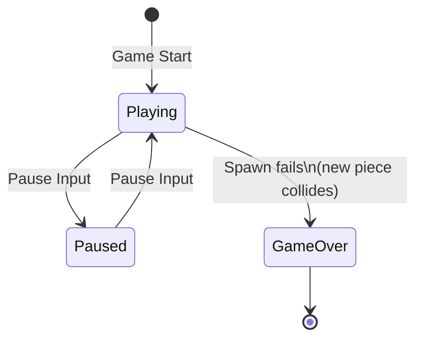
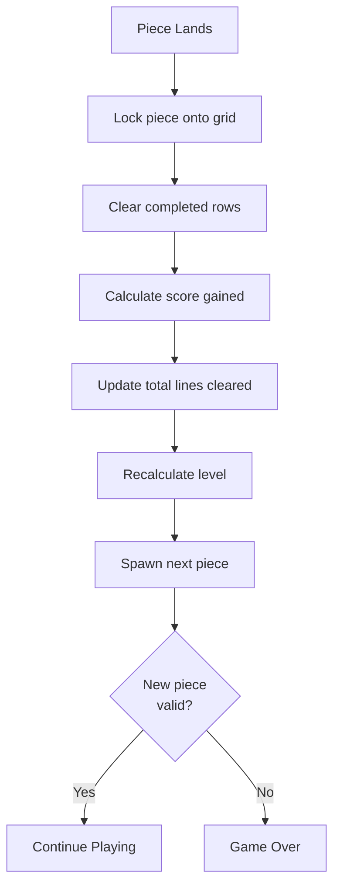

# Monadris Game Logic Specification

## 1. Overview

Monadris is a Tetris clone built with Scala 3 and ZIO, following a pure functional architecture inspired by the Elm Architecture (TEA). The core game logic is entirely pure — no side effects, no mutable state — residing in the `core` project.

The fundamental design pattern is:

```
(GameState, Input) => GameState
```

All game state transitions are deterministic pure functions. The `app` layer handles side effects (terminal I/O, timing, random piece generation) via ZIO, while `core` remains a pure Scala library with no ZIO dependency.

**Key source files:**
- `core/src/main/scala/monadris/game/` — Game logic (`GameLogic`, `GameLoop`, `Collision`, `LineClearing`)
- `core/src/main/scala/monadris/domain/` — Data structures (`GameState`, `Grid`, `Tetromino`, `Input`)
- `core/src/main/scala/monadris/view/` — View transformation (`GameView`)

## 2. Grid & Coordinate System

The playfield is a **10-column x 20-row** grid. The coordinate system uses **Y-axis positive downward** (row 0 is the top).

| Property | Value |
|---|---|
| Width | 10 |
| Height | 20 |
| Origin | (0, 0) = top-left |
| X-axis | Left → Right (0..9) |
| Y-axis | Top → Bottom (0..19) |

### Cell Types

Each cell is represented by the `Cell` enum:

- `Cell.Empty` — No block present
- `Cell.Filled(shape: TetrominoShape)` — Occupied by a locked block, retaining its original shape for coloring

### Rendering Characters

| Character | Meaning | Usage |
|---|---|---|
| `█` | Filled block | Current (falling) piece |
| `▓` | Locked block | Placed/locked pieces on the grid |
| `░` | Ghost block | Ghost piece (drop preview) |
| `·` | Empty cell | Unoccupied grid position |

**References:** `Grid.scala`, `GameView.scala`

## 3. Tetromino Shapes & Spawn

### Seven Standard Tetrominoes

Each shape defines its blocks as relative positions in the **R0** (initial) rotation state:

| Shape | Color | R0 Block Coordinates | ASCII |
|---|---|---|---|
| **I** | Cyan | (-1,0), (0,0), (1,0), (2,0) | `████` |
| **O** | Yellow | (0,0), (1,0), (0,1), (1,1) | `██`<br>`██` |
| **T** | Magenta | (-1,0), (0,0), (1,0), (0,-1) | `·█·`<br>`███` |
| **S** | Green | (-1,0), (0,0), (0,-1), (1,-1) | `·██`<br>`██·` |
| **Z** | Red | (-1,-1), (0,-1), (0,0), (1,0) | `██·`<br>`·██` |
| **J** | Blue | (-1,-1), (-1,0), (0,0), (1,0) | `█··`<br>`███` |
| **L** | White | (-1,0), (0,0), (1,0), (1,-1) | `··█`<br>`███` |

### Spawn Position

All tetrominoes spawn at:

```
Position(gridWidth / 2, 1) = Position(5, 1)
```

Initial rotation is always `R0`.

**Reference:** `Tetromino.scala`

## 4. Rotation (SRS)

### Rotation States

Four rotation states cycle in order:

```
R0 → R90 → R180 → R270 → R0
```

Counter-clockwise reverses the cycle: `R0 → R270 → R180 → R90 → R0`.

### Rotation Transform Matrix

Each rotation applies a coordinate transformation to the relative block positions:

| Rotation | Transform (x, y) → |
|---|---|
| R0 | (x, y) — identity |
| R90 | (-y, x) |
| R180 | (-x, -y) |
| R270 | (y, -x) |

### Wall Kick Offsets

When a rotation results in a collision, the SRS wall kick system tries a sequence of offset positions. The first valid position is used.

**I-piece** (5 offsets):

| # | Offset (dx, dy) |
|---|---|
| 1 | (0, 0) |
| 2 | (-2, 0) |
| 3 | (2, 0) |
| 4 | (-2, 1) |
| 5 | (2, -1) |

**O-piece** (1 offset — effectively no rotation):

| # | Offset (dx, dy) |
|---|---|
| 1 | (0, 0) |

**All other pieces (T, S, Z, J, L)** (6 offsets):

| # | Offset (dx, dy) |
|---|---|
| 1 | (0, 0) |
| 2 | (-1, 0) |
| 3 | (1, 0) |
| 4 | (0, -1) |
| 5 | (-1, -1) |
| 6 | (1, -1) |

If no offset yields a valid position, the rotation is rejected and the piece remains unchanged.

**References:** `Tetromino.scala`, `Collision.scala`

## 5. Collision Detection

### Collision Types

```scala
enum CollisionType:
  case None, Wall, Floor, Block, Ceiling
```

### Detection Priority

Collisions are checked in the following order (first match wins):

1. **Wall** — Any block has `x < 0` or `x >= gridWidth`
2. **Floor** — Any block has `y >= gridHeight`
3. **Ceiling** — Any block has `y < 0`
4. **Block** — Any block overlaps a non-empty cell
5. **None** — No collision

### Position Validity

A position is valid when **all** blocks of the tetromino satisfy:
- Within horizontal bounds: `0 <= x < gridWidth`
- Within vertical bounds: `0 <= y < gridHeight`
- Cell is empty at that position

### Landing Detection

A tetromino has **landed** when:
- Its current position is valid, **AND**
- Moving one step down would result in an invalid position

```
hasLanded(t, grid) = isValidPosition(t, grid) && !isValidPosition(t.moveDown, grid)
```

### Game Over Detection

Game over occurs when a newly spawned tetromino is **not** in a valid position:

```
isGameOver(t, grid) = !isValidPosition(t, grid)
```

**Reference:** `Collision.scala`

## 6. Scoring System

### Base Scores

| Lines Cleared | Name | Base Score |
|---|---|---|
| 1 | Single | 100 |
| 2 | Double | 300 |
| 3 | Triple | 500 |
| 4 | Tetris | 800 |

### Score Calculation

```
Score = BaseScore × Level
```

**Examples:**
- Single at Level 1: 100 × 1 = 100 points
- Tetris at Level 5: 800 × 5 = 4,000 points

### Hard Drop Bonus

When the player performs a hard drop, bonus points are awarded based on the drop distance:

```
HardDropBonus = DropDistance × 2
```

Where `DropDistance` is the number of rows the piece falls (difference between final and initial Y position). The bonus is added **before** line clearing and its associated score.

**References:** `LineClearing.scala`, `GameLogic.scala`

## 7. Level Progression & Speed

### Level Calculation

```
Level = StartLevel + floor(TotalLinesCleared / LinesPerLevel)
```

With default configuration (`StartLevel = 1`, `LinesPerLevel = 10`):

```
Level = 1 + floor(TotalLinesCleared / 10)
```

### Drop Interval

The automatic drop interval decreases as the level increases:

```
DropInterval = max(MinDropInterval, BaseDropInterval − (Level − 1) × DecreasePerLevel)
```

With default values (`BaseDropInterval = 1000ms`, `MinDropInterval = 100ms`, `DecreasePerLevel = 50ms`):

```
DropInterval = max(100, 1000 − (Level − 1) × 50) ms
```

### Speed Table (Default Configuration)

| Level | Drop Interval (ms) | Lines Required |
|---|---|---|
| 1 | 1000 | 0 |
| 2 | 950 | 10 |
| 3 | 900 | 20 |
| 4 | 850 | 30 |
| 5 | 800 | 40 |
| 6 | 750 | 50 |
| 7 | 700 | 60 |
| 8 | 650 | 70 |
| 9 | 600 | 80 |
| 10 | 550 | 90 |
| 11 | 500 | 100 |
| 12 | 450 | 110 |
| 13 | 400 | 120 |
| 14 | 350 | 130 |
| 15 | 300 | 140 |
| 16 | 250 | 150 |
| 17 | 200 | 160 |
| 18 | 150 | 170 |
| 19+ | 100 | 180+ |

The speed caps at 100ms from Level 19 onward.

**References:** `LineClearing.scala`, `AppConfig.scala`

## 8. Game State Machine

### States

```scala
enum GameStatus:
  case Playing
  case Paused
  case GameOver
```

### State Transitions



### Piece Lock Sequence

When a piece lands and is locked, the following steps execute in order:



1. **Lock** — Place current tetromino blocks onto the grid as `Cell.Filled`
2. **Clear Lines** — Identify and remove all completed (full) rows; shift rows above downward
3. **Score** — Calculate `BaseScore × Level` for lines cleared; add to total
4. **Level** — Recalculate level from total lines cleared
5. **Spawn** — Create next tetromino at spawn position; advance the "next piece" preview
6. **Game Over Check** — If the newly spawned piece overlaps existing blocks, transition to `GameOver`

### Input Handling by State

| State | Accepted Inputs | Behavior |
|---|---|---|
| **Playing** | All inputs | Normal game input processing |
| **Paused** | `Pause` only | Resumes to `Playing`; all other inputs ignored |
| **GameOver** | None | All inputs ignored |

**References:** `GameState.scala`, `GameLogic.scala`

## 9. Input Mapping

### Input Commands

```scala
enum Input:
  case MoveLeft, MoveRight, MoveDown
  case RotateClockwise, RotateCounterClockwise
  case HardDrop, Pause, Quit, Tick
```

`Tick` is an internal input generated by the timer for automatic piece drop.

### Key Bindings

| Key | Command |
|---|---|
| `h` / `H` / `←` | Move Left |
| `l` / `L` / `→` | Move Right |
| `j` / `J` / `↓` | Move Down (Soft Drop) |
| `k` / `K` / `↑` | Rotate Clockwise |
| `z` / `Z` | Rotate Counter-Clockwise |
| `Space` | Hard Drop |
| `p` / `P` | Pause / Resume |
| `q` / `Q` | Quit |

The game supports both **Vim-style** (`H/J/K/L`) and **arrow key** navigation.

Arrow keys are parsed via ANSI escape sequences (`ESC [ A/B/C/D`).

**References:** `KeyMapping.scala`, `Input.scala`

## 10. Ghost Piece & Next Piece Preview

### Ghost Piece

The ghost piece shows where the current piece will land if dropped straight down. It is calculated by recursively moving the current piece down one row at a time until it reaches an invalid position:

```
ghostPosition = dropToBottom(currentTetromino, grid)
```

```scala
@annotation.tailrec
def dropToBottom(tetromino: Tetromino, grid: Grid): Tetromino =
  val next = tetromino.moveDown
  if isValidPosition(next, grid) then dropToBottom(next, grid)
  else tetromino
```

The ghost piece is rendered with the `░` character in the same color as the falling piece.

### Next Piece Preview

The next piece is displayed in the information panel to the right of the grid. It is rendered in its **R0** (initial) rotation state with block positions normalized to (0, 0) origin. Each block is drawn as a double-width character (`██`) for visual clarity.

**Reference:** `GameView.scala`
